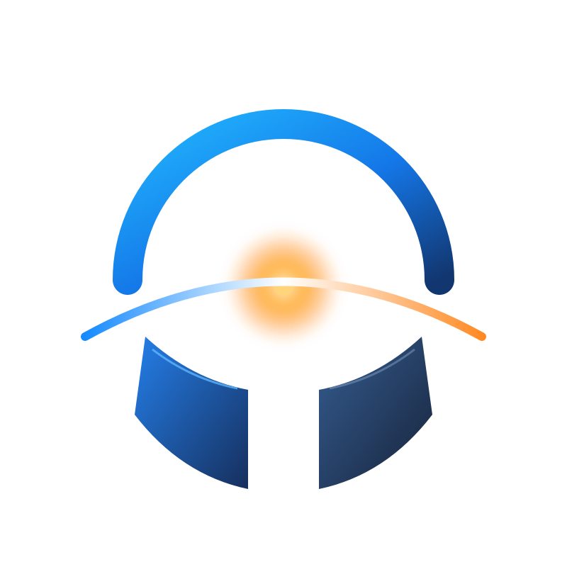

<div align="center">



# HORIZON

### AI-Powered Energy Continuity Intelligence

*When global supply routes fail, your business doesn't have to.*

[](https://rayan-polyinnovae-ai.vercel.app)
[](https://www.loom.com/share/5ec0e1a244f346ada52f1ed3f7a301fa)
[](https://rayanbuilds.me)

**Built for the Polyinnovaa AI Hackathon · August 2026**

[Problem Statement](#-the-challenge) • [Solution](#-what-is-horizon) • [Features](#-features) • [Tech Stack](#-tech-stack) • [Getting Started](#-getting-started)

</div>

---

## 🔥 The Challenge

> **If the Strait of Hormuz were unavailable for a sustained period, what would you design?**

The Strait of Hormuz is THE lifeline for global energy. Over 21 million barrels of crude oil pass through it daily — that's 21% of global petroleum supply.

But here's the thing: geopolitical tensions, conflicts, and disruptions are real. When this critical route goes dark, businesses face:

- ⚠️ **Supply chain collapse** within days
- 📉 **Production shutdowns** affecting revenue
- 🔥 **Customer commitment failures** damaging reputation
- 💸 **Emergency costs** skyrocketing
- ⏱️ **Decision paralysis** under pressure

Most companies? They react after the crisis hits. That's too late.

## 💡 What is Horizon?

Horizon is a **decision-support platform** that helps energy-dependent businesses **see, simulate, and survive** supply route disruptions — specifically the Strait of Hormuz.

Think of it as your **AI co-pilot for energy continuity**. It:

1. **Monitors** geopolitical signals, shipping data, and market conditions 24/7
2. **Analyzes** your company's specific exposure and dependency
3. **Simulates** disruption scenarios (30/90/180 days)
4. **Recommends** continuity strategies with real impact calculations
5. **Prepares** emergency response plans if early warnings fail

### The Core Principle

> **"Horizon recommends. Humans decide."**

We're not replacing human judgment. We're augmenting it with intelligence, speed, and clarity when it matters most.

---

## 🎯 Who Is This For?

### Primary Users
- **Energy-Intensive Manufacturers** (steel, cement, chemicals)
- **Industrial Operations** with high energy dependency
- **Supply Chain Directors** managing critical routes
- **Risk Management Teams** in exposed industries

### Demo Customer
**Bharat Industrial Materials** — An Indian manufacturing company getting 78% of its crude oil through the Strait of Hormuz. Their inventory? Only 45 days. This is their control room.

---

## ✨ Features

Horizon isn't just another dashboard. It's a **decision-support system** built for crisis.

### 1. 🎛️ Control Center (Overview)
The command center. Your first look at exposure.

- **Large metric cards** showing real-time KPIs
  - Hormuz dependency percentage
  - Inventory runway (days remaining)
  - Exposure risk level
- **Risk alert panel** with AI-detected signals
- **Supply route visualization** with live barrel inventory
- **Interactive barrel indicators** showing stock levels

### 2. 🗺️ Supply Network
See your entire energy supply chain in one view.

- **Interactive CSS/SVG network diagram**
- **Clickable route nodes** (Gulf → Hormuz → India)
- **Alternative supply routes** (Russia, Brazil, US)
- **Route dependency analysis** with risk scoring
- **Bottleneck identification** in real-time

### 3. 🚨 Early Warning System
AI-powered signal detection before disruption hits.

- **Multi-source signal monitoring:**
  - Shipping activity anomalies
  - Market price volatility
  - Geopolitical intelligence
  - Port congestion data
- **Risk score calculation** with confidence metrics
- **Exposure assessment** specific to your network
- **Impact explanation** — why this matters to YOU

### 4. 🧪 Scenario Simulator
Test "what if" scenarios before they become reality.

- **Interactive duration selector** (30/90/180 day disruptions)
- **Dynamic inventory visualization** with depletion curves
- **Recharts timeline** showing day-by-day impact
- **AI recommendation engine** with reasoning
- **Before/after impact comparison**
- **Production impact forecasting**
- **Customer commitment risk analysis**

### 5. 🎯 Strategy Planner
Build your continuity playbook.

- **Multiple selectable strategies:**
  - Alternative supplier activation
  - Inventory buffer building
  - Demand adjustment protocols
  - Production prioritization
  - Route diversification
- **Combined impact calculation** for multi-strategy plans
- **Cost-benefit analysis** for each option
- **Plan activation workflow** with timeline
- **Stakeholder communication templates**

### 6. 📊 Impact Analysis
Understand downstream effects and prepare emergency response.

- **Customer risk assessment** — who's affected most
- **Emergency response protocols** if warnings fail
- **"What if early warning fails?" scenarios**
- **System architecture insights**
- **Recovery timeline estimation**

---

## 🎨 Design Philosophy

We built Horizon for **high-stakes decision-making**. The design reflects that.

### The Look
- **Dark enterprise UI** — reduces eye strain during long monitoring sessions
- **Premium glassmorphism** — modern, professional, trustworthy
- **Information hierarchy** — critical data stands out
- **Restrained animations** — smooth but not distracting
- **Color psychology:**
  - 🔵 Blue/Violet accents for intelligence and stability
  - 🟡 Amber warnings for caution
  - 🔴 Red for critical alerts
  - 🟢 Muted green for positive actions

### The Feel
- **Fast** — Vite + optimized React = instant interactions
- **Responsive** — works on desktop, tablet, mobile
- **Accessible** — respects `prefers-reduced-motion`
- **Intuitive** — no training manual needed

### Design System

#### Colors
```css
Near-black backgrounds: #0a0a0b
Dark panels: #1a1b23
Blue accent: #6366f1
Violet accent: #8b5cf6
Warning amber: #f59e0b
Critical red: #ef4444
Success green: #10b981
```

#### Typography
- **Font:** Inter (clean, professional)
- **Large metrics:** 3rem+ for key numbers
- **Hierarchy:** Clear visual distinction
- **Labels:** Uppercase with letter-spacing for emphasis

---

## 🛠️ Tech Stack

Built with modern, production-ready tools.

### Frontend
- **⚛️ React 19** — Latest React with concurrent features
- **⚡ Vite 8** — Lightning-fast build tool and dev server
- **🎬 Framer Motion 13** — Buttery smooth animations
- **📊 Recharts 3** — Beautiful, responsive data visualizations
- **🎨 Lucide React** — Clean, consistent icon system
- **💅 CSS3** — Custom design system with CSS variables

### Why These Choices?

**React 19** → Industry standard, component-based, huge ecosystem  
**Vite** → 10x faster than webpack, hot module replacement is instant  
**Framer Motion** → Best animation library, declarative, performant  
**Recharts** → Built for React, composable, customizable  
**CSS Variables** → Dynamic theming, maintainable, no JS overhead  
**No heavyweight 3D libs** → Faster load times, better performance

---

## 🚀 Getting Started

### Prerequisites
- **Node.js 18+** and **npm** installed
- Modern browser (Chrome, Firefox, Safari, Edge)

### Installation

```bash
# Clone the repo
git clone https://github.com/Rayan-Mohammed-Rafeeq/horizon.git
cd horizon

# Install dependencies
npm install
```

### Development

```bash
# Start dev server
npm run dev
```

Open [http://localhost:5173](http://localhost:5173) 🚀

### Production Build

```bash
# Build for production
npm run build

# Preview production build locally
npm run preview
```

The built files will be in the `dist/` directory, ready to deploy to Vercel, Netlify, or any static host.

---

## 📁 Project Structure

```
horizon/
├── public/
│   ├── logo.svg                     # Horizon logo
│   └── diagrams/                    # System architecture SVGs
├── src/
│   ├── components/
│   │   ├── Sidebar.jsx              # Navigation sidebar
│   │   ├── Topbar.jsx               # Top navigation bar  
│   │   ├── MetricCard.jsx           # Reusable metric displays
│   │   ├── BarrelInventory.jsx      # SVG barrel visualization
│   │   ├── RiskAlert.jsx            # Risk alert panel
│   │   ├── SupplyRouteCard.jsx      # Supply route cards
│   │   ├── Overview.jsx             # Control Center dashboard
│   │   ├── SupplyNetwork.jsx        # Network visualization
│   │   ├── EarlyWarning.jsx         # Signal detection system
│   │   ├── ScenarioSimulator.jsx    # What-if simulator
│   │   ├── Strategy.jsx             # Strategy planner
│   │   ├── Impact.jsx               # Impact analysis
│   │   └── *.css                    # Component styles
│   ├── data/
│   │   └── demoData.js              # Centralized demo data
│   ├── assets/
│   │   └── hero.png                 # Hero image
│   ├── App.jsx                      # Main application
│   ├── main.jsx                     # React entry point
│   └── index.css                    # Global styles & design system
├── index.html
├── package.json
├── vite.config.js
└── README.md
```

---

## 🎮 Key Interactions

1. **Navigation** — Click sidebar items or smooth scroll through sections
2. **Route Selection** — Click supply route cards to view detailed analysis
3. **Network Exploration** — Click nodes in the supply network diagram
4. **Scenario Testing** — Select 30/90/180 day durations to simulate impact
5. **Strategy Selection** — Click strategy cards to build your continuity plan
6. **Plan Activation** — Activate combined multi-strategy plans
7. **Emergency Planning** — Generate emergency response protocols

---

## 🎥 Videos & Links

- **📹 Intro Video:** [Watch on Vercel](https://rayan-polymath-eon-exea.vercel.app/)
- **📹 Product Walkthrough:** [Watch on Loom](https://www.loom.com/share/5ec0e1a244f346ada52f1ed3f7a301fa)
- **💼 Portfolio:** [rayanbuilds.me](https://rayanbuilds.me)
- **👨‍💻 GitHub:** [@Rayan-Mohammed-Rafeeq](https://github.com/Rayan-Mohammed-Rafeeq)

---

## 🧠 The Thinking Behind Horizon

### Product Thinking
This isn't just software. It's a **decision support system** for one of the highest-stakes business scenarios: supply chain collapse.

**The insight:** Most companies react to disruptions. The winners *prepare* for them.

### System Thinking
Behind Horizon's interface is a multi-layer system:

1. **Signal ingestion layer** — Shipping APIs, news feeds, market data
2. **Analysis engine** — Company-specific exposure calculation
3. **Simulation engine** — Scenario modeling with real math
4. **Recommendation engine** — Strategy optimization
5. **Presentation layer** — This UI you see

(See `Impact → System Architecture` section in the app for full diagram)

### Business Thinking
**Go-to-Market Strategy:**

- **Target:** Fortune 500 energy-intensive manufacturers
- **Initial market:** India, South Korea, Japan (high Hormuz dependency)
- **Pricing model:** Annual SaaS subscription + custom integration
- **Sales motion:** Enterprise sales, 6-12 month cycles
- **Customer success:** Dedicated continuity advisors

**Why this matters:** This isn't a nice-to-have tool. It's crisis insurance. When supply routes fail, Horizon could save a company millions — or its existence.

---

## ⚠️ Important Notes

### This is a Hackathon Prototype

**What this DOES include:**
- ✅ Complete interactive frontend
- ✅ Premium UI/UX design
- ✅ Real scenario simulation logic
- ✅ Interactive visualizations
- ✅ Responsive design (desktop, tablet, mobile)
- ✅ Smooth animations and transitions

**What this does NOT include:**
- ❌ Authentication or user management
- ❌ Backend API or database
- ❌ Real-time data ingestion
- ❌ Payment processing
- ❌ Production SaaS infrastructure
- ❌ Multi-tenancy architecture

**Demo Data:** All data is illustrative and does not represent real-time information, actual companies, or production systems.

**Environment:** 🚧 DEMO ENVIRONMENT · ILLUSTRATIVE DATA 🚧

---

## 🌐 Browser Support

- **Chrome/Edge** (latest) ✅
- **Firefox** (latest) ✅
- **Safari** (latest) ✅

---

## 📱 Responsive Design

- **Desktop:** > 1024px (full sidebar, expanded layouts)
- **Tablet:** 769px - 1024px (adapted layouts, collapsible sidebar)
- **Mobile:** ≤ 768px (hamburger menu, stacked layouts, touch-optimized)

---

## 🚀 Performance

- **Lightweight bundle** — No Three.js or heavy 3D libraries
- **CSS/SVG-first** — Hardware-accelerated, efficient rendering
- **Optimized animations** — 60fps with Framer Motion
- **Lazy loading** — Components load on demand
- **Respects user preferences** — Honors `prefers-reduced-motion`

---

## 🤝 Contributing

This is a hackathon submission, but if you want to fork it and build on it:

1. Fork the repo
2. Create a feature branch (`git checkout -b feature/amazing-feature`)
3. Commit your changes (`git commit -m 'Add amazing feature'`)
4. Push to the branch (`git push origin feature/amazing-feature`)
5. Open a Pull Request

---

## 📄 License

MIT License — do whatever you want with it.

---

## 👨‍💻 About the Builder

**Rayan Mohammed Rafeeq**

I build products that solve real problems. Horizon was born from a simple question: *"What if we could see supply chain disruptions coming?"*

This project represents:
- Product thinking (who, what, why)
- Systems thinking (how it works behind the scenes)
- Design thinking (how it feels to use)
- Business thinking (how it goes to market)

**Let's connect:**
- 🌐 Portfolio: [rayanbuilds.me](https://rayanbuilds.me)
- 💼 GitHub: [@Rayan-Mohammed-Rafeeq](https://github.com/Rayan-Mohammed-Rafeeq)
- 📹 Watch the full walkthrough: [Loom Video](https://www.loom.com/share/5ec0e1a244f346ada52f1ed3f7a301fa)

---

<div align="center">

**Built with ❤️ for the Polyinnovaa AI Hackathon · August 2026**

*When the world changes, be ready.*

</div>


